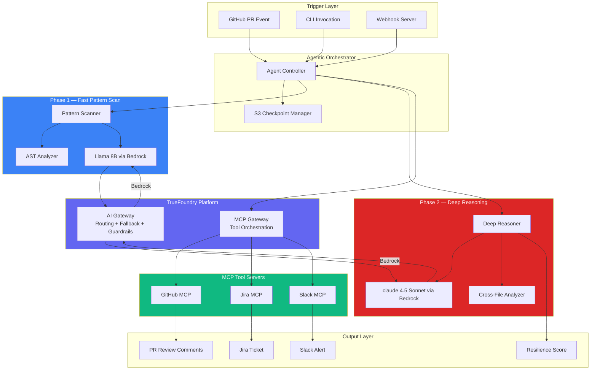

<p align="center">
  
</p>

<h1 align="center">Faultline</h1>
<p align="center">
  <strong>Resilience-first PR review agent — finds silent failures before they cause production outages</strong>
</p>

<p align="center">
  
  
  
  
  
</p>

<p align="center">
  <em>Built for the TrueFoundry Agentic AI Hackathon 2025</em>
</p>

---

## 🔴 The Problem

Every production outage has the same origin story: **code that works perfectly — until it doesn't.**

```typescript
// This code passed every code review. Every linter. Every test.
// It caused a 4-hour outage affecting 2.3 million users.

async function chargeUser(userId: string, amount: number) {
  const user = await db.users.findById(userId);     // ← What if DB is down?
  const result = await payments.charge(user, amount); // ← What if this times out?
  await db.transactions.insert(result);               // ← What if charge succeeded but this fails?
  return { success: true };                            // ← Silent data inconsistency
}
```

**Traditional code reviewers check if code works. Faultline checks how code fails.**

Modern code review tools focus on correctness, style, and performance. None of them systematically ask: *"What happens when the network drops, the database times out, or the payment provider returns garbage?"*

Faultline is an **AI-powered PR review agent** that hunts for **silent resilience failures** — the missing error handlers, absent timeouts, and naked retries that cause 3 AM pages.

---

## 🎯 What Faultline Detects

| # | Anti-Pattern | Severity | What Goes Wrong |
|---|-------------|----------|-----------------|
| 1 | **Swallowed Errors** | 🔴 Critical | `catch(e) {}` — failures vanish silently, data corrupts |
| 2 | **Missing Timeouts** | 🔴 Critical | HTTP calls hang forever, thread pools exhaust, cascading failure |
| 3 | **Naked Retries** | 🟠 High | Retry without backoff → thundering herd → amplified outage |
| 4 | **Incomplete Cleanup** | 🟠 High | Resources leak on error paths — DB connections, file handles, locks |
| 5 | **Missing Circuit Breakers** | 🟡 Medium | Failing service gets hammered, never recovers |
| 6 | **No Fallback Paths** | 🟡 Medium | Single dependency fails → entire feature fails |
| 7 | **Unvalidated External Data** | 🟡 Medium | API returns unexpected shape → runtime crash deep in the stack |
| 8 | **Non-Idempotent Operations** | 🟠 High | Retry charges user twice, sends duplicate notifications |

---

## 🏗️ Architecture



---

## ⚡ Two-Phase Analysis

Faultline uses a **two-phase approach** to balance speed and depth:

### Phase 1 — Fast Pattern Scan (< 5 seconds)
- **Model:** Meta Llama 3 8B via AWS Bedrock (through TrueFoundry AI Gateway)
- **Purpose:** Rapid AST + pattern-based scan for obvious anti-patterns
- **Cost:** ~$0.001 per file
- **Output:** Candidate list of suspicious code regions

### Phase 2 — Deep Reasoning (< 30 seconds)
- **Model:** Anthropic claude 4.5 Sonnet via AWS Bedrock (through TrueFoundry AI Gateway)
- **Purpose:** Cross-file data flow analysis, business logic understanding, nuanced judgment
- **Fallback:** Llama 70B if Claude is rate-limited (configured via AI Gateway)
- **Cost:** ~$0.01 per file
- **Output:** Verified findings with severity, explanation, and fix suggestions

> **Why two phases?** Most files in a PR have zero resilience issues. Phase 1 eliminates clean files cheaply, so Phase 2's expensive reasoning only runs on code that actually needs it. This keeps the median PR review under **$0.05**.

---

## 🚀 Getting Started

### Prerequisites

- **Node.js** ≥ 20.0.0
- **TrueFoundry account** with AI Gateway access
- **AWS Bedrock** access (claude 4.5 Sonnet + Llama 3 models enabled)
- **GitHub App** or personal access token

### 1. Clone & Install

```bash
git clone https://github.com/your-org/faultline.git
cd faultline
npm install
```

### 2. Configure Environment

```bash
cp .env.example .env
# Edit .env with your credentials
```

### 3. Build

```bash
npm run build
```

### 4. Run

```bash
# Analyze a PR via CLI
npm run analyze -- --pr 42 --repo owner/repo

# Start the webhook server
npm start

# Development mode
npm run dev
```

---

## ⚙️ Configuration

### TrueFoundry AI Gateway (`config/gateway.yaml`)

The AI Gateway provides:
- **Unified API** — Single OpenAI-compatible endpoint for all Bedrock models
- **Automatic fallback** — Claude → Llama 70B on rate limits or errors
- **Guardrails** — PII redaction and secret detection before code reaches the LLM
- **Observability** — Every request tagged with PR number, repo, phase, and file path
- **Rate limiting** — Prevents runaway costs on large PRs

### TrueFoundry MCP Gateway (`config/mcp.yaml`)

The MCP Gateway provides:
- **Tool orchestration** — GitHub, Jira, and Slack as MCP tool servers
- **Access control** — Explicit allow/deny lists per tool server
- **Auth management** — Centralized credential injection

---

## 📦 Usage

### As a GitHub Action

```yaml
# .github/workflows/resilience.yml
name: Resilience Review
on:
  pull_request:
    types: [opened, synchronize]

jobs:
  faultline:
    runs-on: ubuntu-latest
    steps:
      - uses: actions/checkout@v4
      - uses: your-org/faultline@v1
        with:
          truefoundry-gateway-url: ${{ secrets.TRUEFOUNDRY_GATEWAY_URL }}
          truefoundry-api-key: ${{ secrets.TRUEFOUNDRY_API_KEY }}
          github-token: ${{ secrets.GITHUB_TOKEN }}
          fail-on-critical: 'true'
```

### As a Webhook Server

```bash
# Deploy via Docker
docker build -t faultline .
docker run -p 3000:3000 --env-file .env faultline

# Or deploy on TrueFoundry
tfy deploy --name faultline --image faultline:latest
```

### As a CLI Tool

```bash
# Analyze a specific PR
npm run analyze -- --pr 42 --repo owner/repo --sha abc123

# Analyze local files
npm run analyze -- --files src/payments.ts src/orders.ts
```

---

## 🔄 Self-Review

Faultline reviews its own code for resilience issues:

```bash
npm run self-review
```

This runs the full two-phase analysis on Faultline's own source code, proving that the tool practices what it preaches. The self-review validates that:

- All HTTP calls have timeouts
- Error handlers don't swallow exceptions
- Retries use exponential backoff
- Resources are cleaned up in all code paths
- The S3 checkpoint system is idempotent

---

## 🏆 Hackathon Context

**Faultline** was built for the **TrueFoundry Agentic AI Hackathon 2025**.

### Why This Matters

| Metric | Industry Data |
|--------|--------------|
| **70%** of production outages | caused by missing error handling ([Google SRE Book](https://sre.google/sre-book/)) |
| **$400B/year** | cost of software failures globally ([Consortium for IT Software Quality](https://www.it-cisq.org/)) |
| **0** existing tools | systematically review PRs for resilience anti-patterns |

### TrueFoundry Platform Usage

| Feature | How Faultline Uses It |
|---------|----------------------|
| **AI Gateway** | Unified Bedrock access with Claude ↔ Llama fallback chain, guardrails, observability |
| **MCP Gateway** | Tool orchestration for GitHub PR comments, Jira ticket creation, Slack alerts |
| **Virtual Keys** | Separate routing for Phase 1 (fast/cheap) vs Phase 2 (deep/accurate) |
| **Guardrails** | Prevents source code PII and secrets from reaching the LLM |

---

## 🧪 Testing

```bash
# Run all tests
npm test

# Run only pattern detector tests
npm run test:patterns

# Run with coverage
npx jest --coverage
```

---

## 📁 Project Structure

```
faultline/
├── src/
│   ├── agent/              # Agentic orchestrator + analysis loop
│   │   ├── index.ts        # Entry point, initAgent()
│   │   └── analyzer.ts     # Core PR analysis pipeline
│   ├── detectors/          # Resilience anti-pattern detection
│   │   ├── index.ts        # Phase 1 & 2 system prompts
│   │   └── patterns.ts     # 8 anti-pattern specifications
│   ├── gateway/            # TrueFoundry AI Gateway client
│   │   ├── client.ts       # OpenAI-compat LLM calls
│   │   └── models.ts       # Model constants & fallbacks
│   ├── guardrails/         # Input/output safety checks
│   │   ├── input.ts        # Secret scrubbing (10 patterns)
│   │   └── output.ts       # Code suggestion validation
│   ├── mcp/                # MCP tool integrations
│   │   ├── github.ts       # PR files, review comments
│   │   ├── jira.ts         # Ticket context enrichment
│   │   └── slack.ts        # Critical finding alerts
│   ├── server/             # Webhook server
│   │   └── webhook.ts      # Express + HMAC verification
│   ├── state/              # Resilience state management
│   │   └── checkpoint.ts   # S3 + local file persistence
│   ├── types/              # TypeScript type definitions
│   │   └── index.ts        # All shared interfaces
│   ├── utils/              # Shared utilities
│   │   ├── formatter.ts    # PR comment & CLI formatting
│   │   └── logger.ts       # Winston production logger
│   ├── test-samples/       # Demo code for testing
│   │   ├── bad-code.py     # All 8 anti-patterns present
│   │   └── good-code.py    # Fixed versions of each
│   ├── cli.ts              # CLI entry point (yargs + chalk)
│   └── action.ts           # GitHub Action entry point
├── config/
│   ├── gateway.yaml        # TrueFoundry AI Gateway config
│   └── mcp.yaml            # TrueFoundry MCP Gateway config
├── .github/workflows/
│   └── faultline.yml       # PR-triggered analysis workflow
├── Dockerfile              # Multi-stage production container
├── action.yml              # GitHub Action marketplace metadata
├── jest.config.js          # Test configuration
└── README.md
```

---

## 📄 License

MIT — see [LICENSE](LICENSE) for details.

---

<p align="center">
  <strong>Stop reviewing code for correctness. Start reviewing it for failure.</strong>
  <br/>
  <em>Because the code that "works" is the code that takes down production.</em>
</p>
