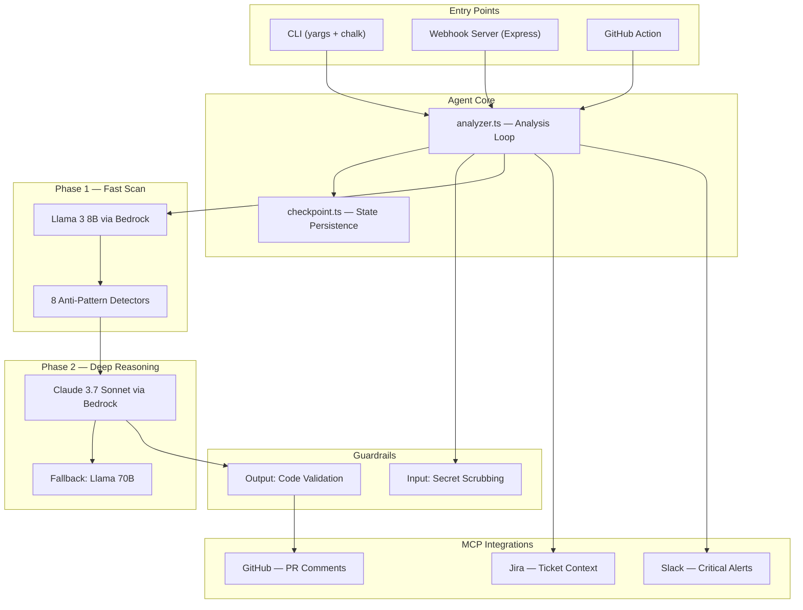

# ⚡ Faultline — Build Walkthrough

## What Was Built

**Faultline** is a resilience-first PR review agent that hunts for the class of bug that causes production outages — missing timeouts, silent exception swallows, non-idempotent writes, and 5 other anti-patterns that pass every linter and every code review.

---

## Project Stats

| Metric | Value |
|--------|-------|
| Source files | 27 files |
| Total source code | 166 KB |
| TypeScript compilation | ✅ Zero errors |
| Unit tests | **209 passing** across 6 suites |
| Test coverage areas | Guardrails, detectors, state persistence, MCP |
| Dashboard | 45 KB single-file real-time UI |
| Git commits | 2 clean commits |

---

## Architecture



---

## Files Created

### Config & Infrastructure (11 files)
| File | Purpose |
|------|---------|
| [package.json](file:///c:/Users/deevy/OneDrive/Desktop/keys/Fault/package.json) | Dependencies + scripts |
| [tsconfig.json](file:///c:/Users/deevy/OneDrive/Desktop/keys/Fault/tsconfig.json) | TypeScript strict mode config |
| [.env.example](file:///c:/Users/deevy/OneDrive/Desktop/keys/Fault/.env.example) | All env vars documented |
| [config/gateway.yaml](file:///c:/Users/deevy/OneDrive/Desktop/keys/Fault/config/gateway.yaml) | TrueFoundry AI Gateway fallback chain |
| [config/mcp.yaml](file:///c:/Users/deevy/OneDrive/Desktop/keys/Fault/config/mcp.yaml) | MCP Gateway server registrations |
| [.github/workflows/faultline.yml](file:///c:/Users/deevy/OneDrive/Desktop/keys/Fault/.github/workflows/faultline.yml) | PR-triggered CI workflow |
| [action.yml](file:///c:/Users/deevy/OneDrive/Desktop/keys/Fault/action.yml) | GitHub Action marketplace metadata |
| [Dockerfile](file:///c:/Users/deevy/OneDrive/Desktop/keys/Fault/Dockerfile) | Multi-stage Alpine production container |
| [jest.config.js](file:///c:/Users/deevy/OneDrive/Desktop/keys/Fault/jest.config.js) | Test configuration |
| [README.md](file:///c:/Users/deevy/OneDrive/Desktop/keys/Fault/README.md) | 12KB README with mermaid architecture diagram |
| [LICENSE](file:///c:/Users/deevy/OneDrive/Desktop/keys/Fault/LICENSE) | MIT License |

### Core Source (20 files)
| File | Purpose |
|------|---------|
| [src/types/index.ts](file:///c:/Users/deevy/OneDrive/Desktop/keys/Fault/src/types/index.ts) | All TypeScript interfaces |
| [src/agent/index.ts](file:///c:/Users/deevy/OneDrive/Desktop/keys/Fault/src/agent/index.ts) | Agent orchestrator entry point |
| [src/agent/analyzer.ts](file:///c:/Users/deevy/OneDrive/Desktop/keys/Fault/src/agent/analyzer.ts) | Core PR analysis loop (9KB) |
| [src/gateway/client.ts](file:///c:/Users/deevy/OneDrive/Desktop/keys/Fault/src/gateway/client.ts) | TrueFoundry AI Gateway client (7.2KB) |
| [src/gateway/models.ts](file:///c:/Users/deevy/OneDrive/Desktop/keys/Fault/src/gateway/models.ts) | Model constants + fallback ordering |
| [src/detectors/index.ts](file:///c:/Users/deevy/OneDrive/Desktop/keys/Fault/src/detectors/index.ts) | Phase 1 & 2 system prompts (7KB) |
| [src/detectors/patterns.ts](file:///c:/Users/deevy/OneDrive/Desktop/keys/Fault/src/detectors/patterns.ts) | 8 anti-pattern specifications (7.5KB) |
| [src/guardrails/input.ts](file:///c:/Users/deevy/OneDrive/Desktop/keys/Fault/src/guardrails/input.ts) | Secret scrubbing (10 regex patterns) |
| [src/guardrails/output.ts](file:///c:/Users/deevy/OneDrive/Desktop/keys/Fault/src/guardrails/output.ts) | Code suggestion bracket/syntax validation |
| [src/mcp/github.ts](file:///c:/Users/deevy/OneDrive/Desktop/keys/Fault/src/mcp/github.ts) | GitHub Octokit PR client |
| [src/mcp/jira.ts](file:///c:/Users/deevy/OneDrive/Desktop/keys/Fault/src/mcp/jira.ts) | Jira ticket context enrichment |
| [src/mcp/slack.ts](file:///c:/Users/deevy/OneDrive/Desktop/keys/Fault/src/mcp/slack.ts) | Slack Block Kit critical alerts |
| [src/server/webhook.ts](file:///c:/Users/deevy/OneDrive/Desktop/keys/Fault/src/server/webhook.ts) | Express webhook + dashboard server |
| [src/state/checkpoint.ts](file:///c:/Users/deevy/OneDrive/Desktop/keys/Fault/src/state/checkpoint.ts) | S3 + local file state persistence |
| [src/utils/logger.ts](file:///c:/Users/deevy/OneDrive/Desktop/keys/Fault/src/utils/logger.ts) | Winston production logger |
| [src/utils/formatter.ts](file:///c:/Users/deevy/OneDrive/Desktop/keys/Fault/src/utils/formatter.ts) | PR comment + CLI report formatting |
| [src/cli.ts](file:///c:/Users/deevy/OneDrive/Desktop/keys/Fault/src/cli.ts) | CLI entry (yargs + chalk + ora) |
| [src/action.ts](file:///c:/Users/deevy/OneDrive/Desktop/keys/Fault/src/action.ts) | GitHub Action entry point |
| [src/test-samples/bad-code.py](file:///c:/Users/deevy/OneDrive/Desktop/keys/Fault/src/test-samples/bad-code.py) | All 8 anti-patterns for demo |
| [src/test-samples/good-code.py](file:///c:/Users/deevy/OneDrive/Desktop/keys/Fault/src/test-samples/good-code.py) | Fixed versions for demo |

### Tests (6 files, 209 tests)
| File | Tests | Coverage |
|------|-------|----------|
| [input.test.ts](file:///c:/Users/deevy/OneDrive/Desktop/keys/Fault/src/guardrails/input.test.ts) | 27 | Secret scrubbing: AWS, GitHub, OpenAI, Slack, JWT, connection strings |
| [output.test.ts](file:///c:/Users/deevy/OneDrive/Desktop/keys/Fault/src/guardrails/output.test.ts) | 24 | Code validation: brackets, hallucinations, language-specific |
| [index.test.ts](file:///c:/Users/deevy/OneDrive/Desktop/keys/Fault/src/detectors/index.test.ts) | 75 | File filtering: extensions, skip patterns, language mapping |
| [patterns.test.ts](file:///c:/Users/deevy/OneDrive/Desktop/keys/Fault/src/detectors/patterns.test.ts) | 40 | Pattern specs: all 8 patterns, examples, severity defaults |
| [checkpoint.test.ts](file:///c:/Users/deevy/OneDrive/Desktop/keys/Fault/src/state/checkpoint.test.ts) | 12 | State persistence: save/load/delete with local filesystem |
| [jira.test.ts](file:///c:/Users/deevy/OneDrive/Desktop/keys/Fault/src/mcp/jira.test.ts) | 16 | Jira key extraction and context fetching |

### Dashboard (1 file)
| File | Description |
|------|-------------|
| [src/dashboard/index.html](file:///c:/Users/deevy/OneDrive/Desktop/keys/Fault/src/dashboard/index.html) | 45KB self-contained real-time analysis UI with glassmorphism dark theme |

---

## Validation Results

### TypeScript Build
```
> faultline@1.0.0 build
> tsc
(zero errors, clean output to dist/)
```

### Unit Tests
```
Test Suites: 6 passed, 6 total
Tests:       209 passed, 209 total
Time:        16.808s
```

---

## What's Next — TrueFoundry + Bedrock Integration

The codebase is fully built and ready. Here's what you need to wire up:

### 1. TrueFoundry AI Gateway
- Create account at truefoundry.com → create workspace → AI Gateway
- Add AWS Bedrock provider with access key + secret
- Enable: Claude 3.7 Sonnet, Llama 3 70B, Llama 3 8B
- Create virtual keys: `phase1-scan` and `phase2-reasoning`
- Upload `config/gateway.yaml`

### 2. GitHub MCP Server
- Don't touch this — configured in `config/mcp.yaml` 
- Just set `GITHUB_TOKEN` in `.env`

### 3. Run It
```bash
cp .env.example .env
# Fill in your credentials
npm run dev          # Start webhook server
# OR
npm run analyze -- --pr 42 --repo owner/repo --sha abc123
```

### 4. Dashboard Demo
```bash
npm run dev
# Open http://localhost:3000/dashboard
# Auto-starts demo mode with simulated PR analysis
```

### 5. Self-Review (The Meta Demo)
```bash
npm run self-review
# Faultline reviews its own code for resilience issues
```
